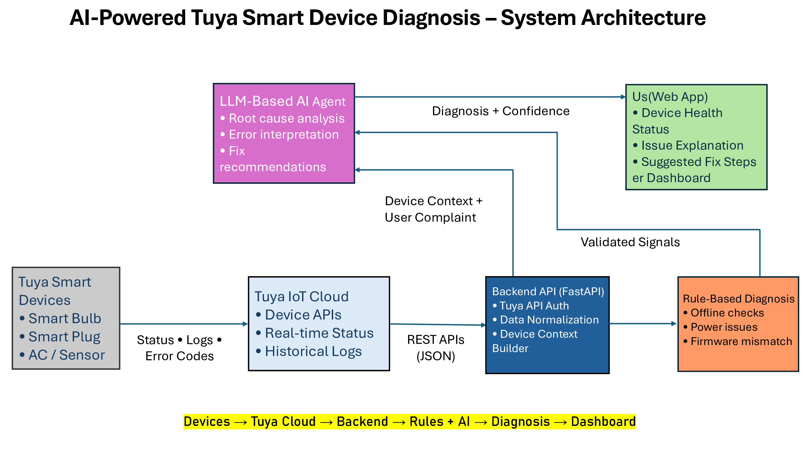

# TuyaCare Copilot

## Project Overview
TuyaCare Copilot is an AI-powered diagnostic assistant designed to help users and support teams quickly identify and resolve issues in Tuya-based smart devices. The system analyzes device telemetry, logs, and user-reported symptoms to generate reliable root-cause analysis and step-by-step remediation guidance.

This project is built on top of the TuyaOpen ecosystem and demonstrates how AI agents can improve the usability, reliability, and support experience of AIoT products.

---

## Problem Statement
Smart home users frequently encounter issues such as device disconnections, unstable behavior, firmware mismatches, and power-related failures. While Tuya devices generate rich telemetry and error data, this information is not easily interpretable by non-technical users.

As a result:
- Troubleshooting is slow and frustrating  
- Support costs increase  
- Devices are often reset or replaced unnecessarily  

---

## Solution
TuyaCare Copilot acts as an intelligent layer on top of Tuya Cloud APIs.

The system:
1. Fetches real-time and historical device data from Tuya Cloud
2. Normalizes and contextualizes device logs and error signals
3. Applies rule-based validation to ensure reliability
4. Uses an LLM-based AI agent to perform root-cause diagnosis
5. Generates clear, actionable fix recommendations for users

This hybrid **Rules + AI** approach balances accuracy, explainability, and flexibility.

---

## System Architecture


---

## Workflow
1. Tuya smart devices send status, logs, and error events to Tuya Cloud  
2. Backend API authenticates with Tuya Cloud and retrieves device data  
3. Rule engine performs deterministic checks for known failure patterns  
4. AI diagnosis agent analyzes validated context and user complaints  
5. Diagnosis and fix steps are delivered to the user dashboard  

**Flow:**  
Devices → Tuya Cloud → Backend API → Rules + AI Agent → Diagnosis → Dashboard

---

## Tech Stack
- **Backend:** Python, FastAPI  
- **Frontend:** HTML, JavaScript  
- **AI Layer:** LLM-based diagnosis agent  
- **IoT Platform:** TuyaOpen (Simulated device model)  

---

## Hardware List (Simulated)
- Tuya Smart Devices (Smart Bulb, Smart Plug, Sensors)
- Tuya Cloud APIs

> Note: Hardware is simulated for rapid prototyping during the hackathon phase.

---

## Results & Capabilities
- Identifies common IoT failure modes (connectivity, firmware, power)
- Produces human-readable explanations instead of raw error codes
- Provides step-by-step troubleshooting guidance
- Scales across device types using a unified diagnosis pipeline

---

## Demo Output


---

## How to Run Locally

```bash
cd backend
python -m venv venv
venv\Scripts\activate
pip install -r requirements.txt
uvicorn main:app --reload
